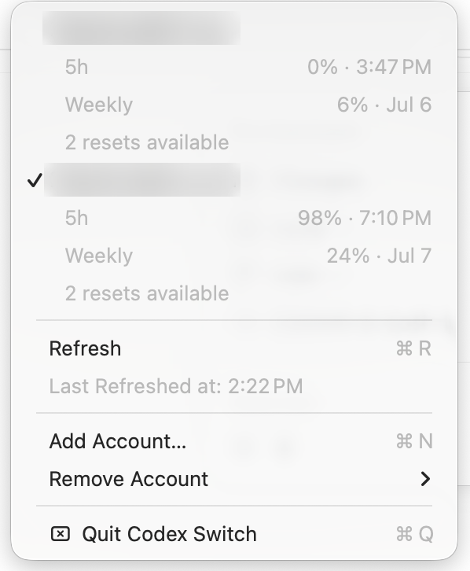

# ⇄ Codex Switch

<p align="center">
  
</p>

<p align="center">
  <a href="https://github.com/2xf-org/codex-switch/actions/workflows/build.yml">
    
  </a>
</p>

A tiny macOS menu bar app for switching between multiple Codex accounts in the
[CLI](https://developers.openai.com/codex/cli) and desktop app.

Codex Switch keeps a local registry of saved logins and swaps the active account
in a click. It has no Dock icon, no third-party service, and no telemetry.

<p align="center">
  
</p>

## Installing

Requires macOS 13+ and Xcode command line tools.

Download the latest app from [Releases](https://github.com/2xf-org/codex-switch/releases), or build it locally:

```sh
./build.sh
open "Codex Switch.app"
```

To keep it around, move `Codex Switch.app` to `/Applications` and add it to
**System Settings → General → Login Items**.

## Using

- **Switch**: choose a saved account from the menu.
- **Usage**: quota and reset rows refresh every five minutes, or immediately via
  **Refresh**.
- **Add Account...**: opens Terminal, runs `codex login` in a temporary home, and
  imports the new login when sign-in finishes.
- **Remove Account**: soft-deletes a saved login to `~/.codex-accounts/.removed`.
  The active account is protected; switch away before removing it.

## How it works

```text
~/.codex/auth.json                     # login Codex uses right now
~/.codex-accounts/<email>.auth.json    # one saved copy per account
~/.codex-accounts/.removed/            # recoverable removed logins
```

The email label is read from the `id_token` inside each `auth.json`. When you
switch accounts, the current login is backed up first, then the selected login is
copied into `~/.codex/auth.json`, which Codex uses for both the CLI and app.
Usage is fetched from ChatGPT with each saved account token; tokens stay in the
local auth files and are not sent anywhere else.

## Development

```sh
./build.sh
```

No Xcode project is required. The build script regenerates the app icon, menu bar
glyph, and README icon before compiling the app bundle.

Swap glyph based on Lucide's [`arrow-left-right`](https://lucide.dev/icons/arrow-left-right) icon (ISC).
